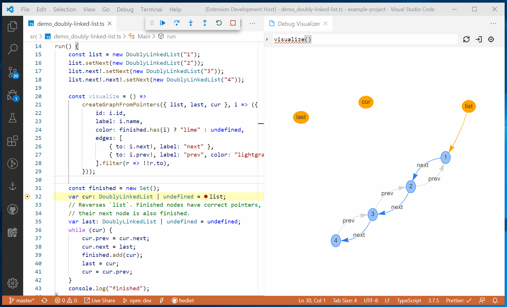

# Debug Visualizer

[](https://twitter.com/intent/follow?screen_name=hediet_dev)

A VS Code extension for visualizing data structures during debugging.



## Usage

After installing this extension, use the command `Open a new Debug Visualizer View` to open a new visualizer view.
In this view you can enter an expression that is evaluated and visualized while stepping through your application, e.g.

```ts
{ kind: { graph: true }, nodes: [ { id: "1", label: "1" }, { id: "2", label: "2" } ], edges: [{ from: "1", to: "2", label: "edge" }]}
```

You can implement your own functions to extract this debug data from your custom data structures.
See [here](../data-extraction/README.md) for documentation of the `createGraphFromPointers` helper.

## Integrated Visualizers

Visualizers present data extracted by a _Data Extractor_.
Visualizers are (mostly) React components and live in the webview of the extension.

### Tree Visualization

The tree visualizer renders data that matches the `Tree` interface.

```ts
interface Tree<TData = unknown> {
	kind: { tree: true };
	root: TreeNode<TData>;
}
interface TreeNode<TExtraData> {
	id: string | undefined;
	name: string;
	value: string | undefined;
	emphasizedValue: string | undefined;
	children: TreeNode<TExtraData>[];
	data: TExtraData;
	isMarked: boolean;
}
```


### AST Visualization

The AST visualizer renders data that matches the `Ast` interface.

```ts
interface Ast
	extends Tree<{
			position: number;
			length: number;
		}>,
		Text {
	kind: { text: true; tree: true; ast: true };
}
```

In addition to the tree view, the text representation is shown.


### Text Visualization

The text visualizer renders data that matches the `Text` interface.

```ts
interface Text {
	kind: { text: true };
	text: string;
	mimeType?: string;
	fileName?: string;
}
```

The `mimeType` and the file extension of `fileName` are used for syntax highlighting.

### SVG Visualization

The SVG visualizer renders data that matches the `Svg` interface.
The actual SVG data must be stored in `text`.

```ts
interface Svg extends Text {
	kind: { text: true; svg: true };
}
```

### Dot Graph Visualization

The Graphviz Dot visualizer renders data that matches the `DotGraph` interface.

```ts
interface DotGraph extends Text {
	kind: { text: true; dotGraph: true };
}
```

`Viz.js` (Graphviz) is used for rendering.

### Graph Visualization

The Graphviz and vis.js visualizers render data that matches the `Graph` interface.

```ts
interface Graph {
	kind: { graph: true };
	nodes: NodeGraphData[];
	edges: EdgeGraphData[];
}

interface NodeGraphData {
	id: string;
	label: string;
	color?: string;
}

interface EdgeGraphData {
	from: string;
	to: string;
	label: string;
	id?: string;
	color?: string;
	weight?: number;
}
```

The graphviz visualizer uses the SVG viewer to render the SVG created by `viz.js`.


## Integrated Data Extractors

Data extractors convert arbitrary values into visualizable data.
They live in the debugee. The following data extractors are injected automatically by this extension.
Custom data extractors can be registered too.

### ToString

Just calls `.toString()` on values and treats the result as text.

### TypeScript AST

-   Direct Visualization of `ts.Node`s
-   Visualization of `Record<string, ts.Node>` and `[ts.Node]`. If the record contains a key `fn`, its value is displayed for each node.

### As Is Data Extractor

Treats the data as direct input to the visualizer.

### Use Method 'getDebugVisualization'

Calls `.getDebugVisualization()` on values and treats the result as direct input to the visualizer.

## UI Features

-   Multiline Expressions: Press `shift+enter` to add a new line, ctrl+enter to evaluate the expression.
    Subsequent new lines can be inserted with a single `enter`.

## Limitations

Currently, only JavaScript (and thus TypeScript) values can be visualized and only a few visualizations are supported.
The architecture is solid enough to support other languages in the future.

# `@hediet/debug-visualizer-data-extraction`

A library that provides infrastructure to implement and register custom data extractors.
See [README](../data-extraction/README.md) of the library for more info.

# See Also

This extension works very well together with my library [`@hediet/node-reload`](https://github.com/hediet/node-reload).
Together, they provide an interactive typescript playground.


