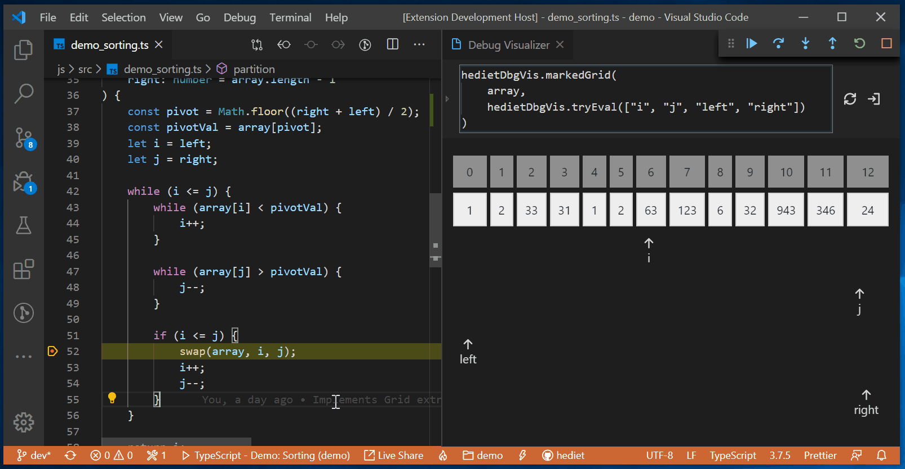
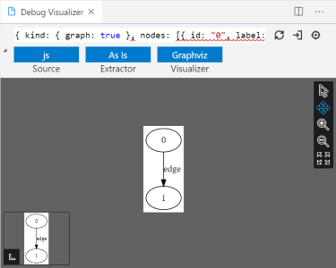
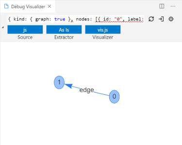
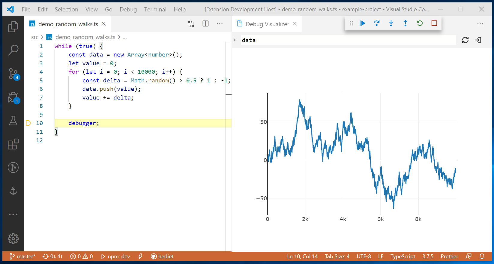
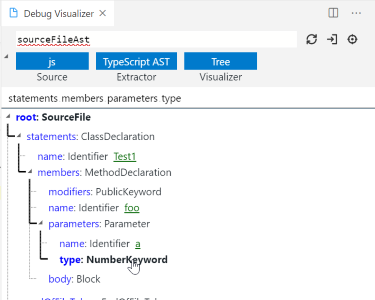
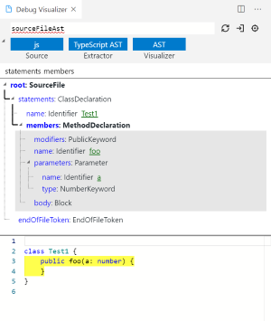
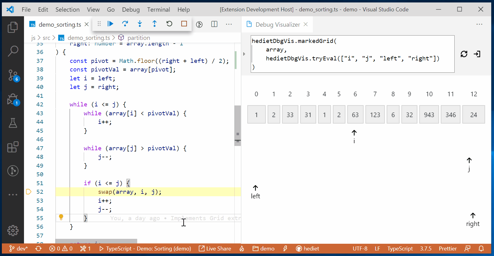
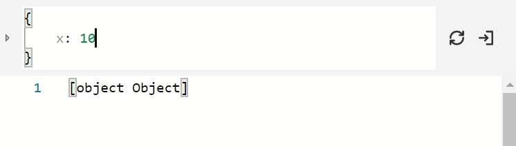

# Debug Visualizer

[](https://twitter.com/intent/follow?screen_name=hediet_dev)

A VS Code extension for visualizing data structures while debugging.



## Supported Languages

See [demos](./demos/) for demos. These languages and debuggers are verified to work with this extension:

-   JavaScript/TypeScript/... using `node`/`node2`/`extensionHost` or `chrome` debug adapter: [⭐ Full Support](../demos/js)
-   Go using `go` (Delve) debug adapter: [✅ Rudimentary Support](../demos/golang)
-   Python using `python` debug adapter: [✅ Rudimentary Support](../demos/python)
-   C# using `coreclr` debug adapter: [✅ Rudimentary Support](../demos/csharp)
-   PHP using `php` debug adapter: [✅ Rudimentary Support](../demos/php)
-   Java using `java` debug adapter: [✅ Rudimentary Support](../demos/java)
-   C++ using `cppdbg` debug adapter: [✅ Rudimentary Support](../demos/cpp)
-   Swift using `lldb` debug adapter: [✅ Rudimentary Support](../demos/swift)

All other languages and debuggers might work too.
For languages with _Rudimentary Support_, only JSON strings can be visualized - you must implement some logic that builds this JSON for your data structure!
Fully supported languages offer _Data Extractors_ which convert some well known data structures to json.

## Usage

After installing this extension, use the command `Debug Visualizer: New View` to open a new visualizer view.
In this view you can enter an expression that is evaluated and visualized while stepping through your application.

You can refresh the evaluation and pop out the current visualizer view into a new browser window by using the top right buttons.
You can also unfold the details pane to select a _Data Extractor_ and a _Visualizer_.

Use the command `Debug Visualizer: Use Selection as Expression` (Shift + F1) to use the currently selected text as expression
in the most recently opened debug visualizer.

## Supported Values

Visualizers consume specific JSON data. See [Integrated Visualizers](#Integrated%20Visualizers) for the schema of supported JSON data.

The currently visualized expression should evaluate to a JSON Object string,
matching the schema of one of the supported visualizers. This JSON string may be surrounded by single or double quotation marks (or none at all) and must not be escaped.
A valid example is `"{ "kind": { "text": true }, "text": "some text\nmore text" }"`.

For some languages (TypeScript/JavaScript), runtime code is injected to support _Data Extractors_.
A Data Extractor lifts the requirement for the visualized value to be a JSON string
and acts as a bridge between custom data structures and the JSON data processed by the visualizers.
When multiple Data Extractors are applicable, a preferred one can be selected in the visualization view.

## Integrated Visualizers

The following visualizers are built into this extension.

### Graph Visualization

[Demo](https://hediet.github.io/vscode-debug-visualizer/?value=%7B%0A++++%22kind%22%3A+%7B+%22graph%22%3A+true+%7D%2C%0A++++%22nodes%22%3A+%5B%0A++++++++%7B+%22id%22%3A+%221%22%2C+%22label%22%3A+%221%22+%7D%2C%0A++++++++%7B+%22id%22%3A+%222%22%2C+%22label%22%3A+%222%22%2C+%22color%22%3A+%22orange%22+%7D%2C%0A++++++++%7B+%22id%22%3A+%223%22%2C+%22label%22%3A+%223%22+%7D%0A++++%5D%2C%0A++++%22edges%22%3A+%5B%0A++++++++%7B+%22from%22%3A+%221%22%2C+%22to%22%3A+%222%22%2C+%22color%22%3A+%22red%22+%7D%2C%0A++++++++%7B+%22from%22%3A+%221%22%2C+%22to%22%3A+%223%22+%7D%0A++++%5D%0A%7D).
The Graphviz and vis.js visualizers render data that matches the `Graph` interface.

```ts
interface Graph {
	kind: { graph: true };
	nodes: NodeGraphData[];
	edges: EdgeGraphData[];
}

interface NodeGraphData {
	id: string;
	label?: string;
	color?: string;
	shape?: "ellipse" | "box";
}

interface EdgeGraphData {
	from: string;
	to: string;
	label?: string;
	id?: string;
	color?: string;
	dashes?: boolean;
}
```

The graphviz visualizer uses the SVG viewer to render the SVG created by `viz.js`.




### Plotly Visualization

[Demo](https://hediet.github.io/vscode-debug-visualizer/?value=%7B%22kind%22%3A%7B%22plotly%22%3Atrue%7D%2C%22data%22%3A%5B%7B%22y%22%3A%5B0%2C1%2C2%2C3%2C4%2C3%2C4%2C3%2C2%2C1%2C2%5D%7D%5D%7D).
The plotly visualizer uses plotly and can visualize JSON data matching the following interface:

```ts
export interface Plotly {
	kind: { plotly: true };
	data: Partial<Plotly.Data>[];
}
// See plotly docs for Plotly.Data.
```



### Tree Visualization

The tree visualizer renders data that matches the `Tree` interface.

```ts
interface Tree<TData = unknown> {
	kind: { tree: true };
	root: TreeNode<TData>;
}
interface TreeNode<TExtraData> {
	id: string | undefined;
	name: string;
	value: string | undefined;
	emphasizedValue: string | undefined;
	children: TreeNode<TExtraData>[];
	data: TExtraData;
	isMarked: boolean;
}
```



### AST Visualization

[Demo](https://hediet.github.io/vscode-debug-visualizer/?value=%7B%22kind%22%3A%7B%22text%22%3Atrue%2C%22tree%22%3Atrue%2C%22ast%22%3Atrue%7D%2C%22root%22%3A%7B%22name%22%3A%22SourceFile%22%2C%22id%22%3A%22root%22%2C%22children%22%3A%5B%7B%22name%22%3A%22ClassDeclaration%22%2C%22id%22%3A%22statements%22%2C%22children%22%3A%5B%7B%22name%22%3A%22Identifier%22%2C%22id%22%3A%22name%22%2C%22children%22%3A%5B%5D%2C%22data%22%3A%7B%22length%22%3A6%2C%22position%22%3A6%7D%2C%22isMarked%22%3Afalse%2C%22value%22%3A%22Test1%22%7D%2C%7B%22name%22%3A%22MethodDeclaration%22%2C%22id%22%3A%22members%22%2C%22children%22%3A%5B%7B%22name%22%3A%22PublicKeyword%22%2C%22id%22%3A%22modifiers%22%2C%22children%22%3A%5B%5D%2C%22data%22%3A%7B%22length%22%3A8%2C%22position%22%3A14%7D%2C%22isMarked%22%3Afalse%7D%2C%7B%22name%22%3A%22Identifier%22%2C%22id%22%3A%22name%22%2C%22children%22%3A%5B%5D%2C%22data%22%3A%7B%22length%22%3A4%2C%22position%22%3A22%7D%2C%22isMarked%22%3Afalse%2C%22value%22%3A%22foo%22%7D%2C%7B%22name%22%3A%22Parameter%22%2C%22id%22%3A%22parameters%22%2C%22children%22%3A%5B%7B%22name%22%3A%22Identifier%22%2C%22id%22%3A%22name%22%2C%22children%22%3A%5B%5D%2C%22data%22%3A%7B%22length%22%3A1%2C%22position%22%3A27%7D%2C%22isMarked%22%3Afalse%2C%22value%22%3A%22a%22%7D%2C%7B%22name%22%3A%22NumberKeyword%22%2C%22id%22%3A%22type%22%2C%22children%22%3A%5B%5D%2C%22data%22%3A%7B%22length%22%3A7%2C%22position%22%3A29%7D%2C%22isMarked%22%3Afalse%7D%5D%2C%22data%22%3A%7B%22length%22%3A9%2C%22position%22%3A27%7D%2C%22isMarked%22%3Afalse%7D%2C%7B%22name%22%3A%22Block%22%2C%22id%22%3A%22body%22%2C%22children%22%3A%5B%7B%22name%22%3A%22VariableStatement%22%2C%22id%22%3A%22statements%22%2C%22children%22%3A%5B%7B%22name%22%3A%22VariableDeclarationList%22%2C%22id%22%3A%22declarationList%22%2C%22children%22%3A%5B%7B%22name%22%3A%22VariableDeclaration%22%2C%22id%22%3A%22declarations%22%2C%22children%22%3A%5B%7B%22name%22%3A%22Identifier%22%2C%22id%22%3A%22name%22%2C%22children%22%3A%5B%5D%2C%22data%22%3A%7B%22length%22%3A2%2C%22position%22%3A47%7D%2C%22isMarked%22%3Afalse%2C%22value%22%3A%22x%22%7D%2C%7B%22name%22%3A%22ObjectLiteralExpression%22%2C%22id%22%3A%22initializer%22%2C%22children%22%3A%5B%7B%22name%22%3A%22PropertyAssignment%22%2C%22id%22%3A%22properties%22%2C%22children%22%3A%5B%7B%22name%22%3A%22Identifier%22%2C%22id%22%3A%22name%22%2C%22children%22%3A%5B%5D%2C%22data%22%3A%7B%22length%22%3A2%2C%22position%22%3A53%7D%2C%22isMarked%22%3Afalse%2C%22value%22%3A%22a%22%7D%2C%7B%22name%22%3A%22FirstLiteralToken%22%2C%22id%22%3A%22initializer%22%2C%22children%22%3A%5B%5D%2C%22data%22%3A%7B%22length%22%3A2%2C%22position%22%3A56%7D%2C%22isMarked%22%3Afalse%2C%22value%22%3A%225%22%7D%5D%2C%22data%22%3A%7B%22length%22%3A5%2C%22position%22%3A53%7D%2C%22isMarked%22%3Afalse%7D%5D%2C%22data%22%3A%7B%22length%22%3A9%2C%22position%22%3A51%7D%2C%22isMarked%22%3Afalse%7D%5D%2C%22data%22%3A%7B%22length%22%3A13%2C%22position%22%3A47%7D%2C%22isMarked%22%3Afalse%7D%5D%2C%22data%22%3A%7B%22length%22%3A21%2C%22position%22%3A39%7D%2C%22isMarked%22%3Afalse%7D%5D%2C%22data%22%3A%7B%22length%22%3A22%2C%22position%22%3A39%7D%2C%22isMarked%22%3Afalse%7D%5D%2C%22data%22%3A%7B%22length%22%3A27%2C%22position%22%3A37%7D%2C%22isMarked%22%3Afalse%7D%5D%2C%22data%22%3A%7B%22length%22%3A50%2C%22position%22%3A14%7D%2C%22isMarked%22%3Afalse%7D%5D%2C%22data%22%3A%7B%22length%22%3A66%2C%22position%22%3A0%7D%2C%22isMarked%22%3Afalse%7D%2C%7B%22name%22%3A%22EndOfFileToken%22%2C%22id%22%3A%22endOfFileToken%22%2C%22children%22%3A%5B%5D%2C%22data%22%3A%7B%22length%22%3A1%2C%22position%22%3A66%7D%2C%22isMarked%22%3Afalse%7D%5D%2C%22data%22%3A%7B%22length%22%3A67%2C%22position%22%3A0%7D%2C%22isMarked%22%3Atrue%7D%2C%22text%22%3A%22%5Cnclass+Test1+%7B%5Cn%5Ctpublic+foo%28a%3A+number%29+%7B%5Cn%5Ct%5Ctconst+x+%3D+%7B+a%3A+5+%7D%3B%5Cn%5Ct%7D%5Cn%7D%5Cn%22%2C%22fileName%22%3A%22index.ts%22%7D).
The AST (Abstract Syntax Tree) visualizer renders data that matches the `Ast` interface.

```ts
interface Ast
	extends Tree<{
			position: number;
			length: number;
		}>,
		Text {
	kind: { text: true; tree: true; ast: true };
}
```

Additionally to the tree view, the source code is rendered and when selecting an AST node,
its span in the source code is highlighted.



### Grid Visualization

Visualizes data matching the following interface:

```ts
export interface Grid {
	kind: { array: true };
	columnLabels?: { label?: string }[];
	rows: {
		label?: string;
		columns: {
			content?: string;
			tag?: string;
			color?: string;
		}[];
	}[];
	markers?: {
		id: string;

		row: number;
		column: number;
		rows?: number;
		columns?: number;

		label?: string;
		color?: string;
	}[];
}
```



### Text Visualization

The text visualizer renders data that matches the `Text` interface.

```ts
interface Text {
	kind: { text: true };
	text: string;
	mimeType?: string;
	fileName?: string;
}
```

The `mimeType` and the file extension of `fileName` are used for syntax highlighting.

### SVG Visualization

The SVG visualizer renders data that matches the `Svg` interface.
The actual SVG data must be stored in `text`.

```ts
interface Svg extends Text {
	kind: { text: true; svg: true };
}
```

### Dot Graph Visualization

The Graphviz Dot visualizer renders data that matches the `DotGraph` interface.

```ts
interface DotGraph extends Text {
	kind: { text: true; dotGraph: true };
}
```

`Viz.js` (Graphviz) is used for rendering.

## JavaScript/TypeScript Integrated Data Extractors

Data extractors convert arbitrary values into data consumable by visualizers.
They live in the debugee. The following data extractors are injected automatically into the debugee by this extension when using the `node`, `node2`, `extensionHost` or `chrome` debug adapter.
Custom data extractors can be registered too.
See the package `@hediet/debug-visualizer-data-extraction` and its [README](../data-extraction/README.md) for the implementation and its API.
Also, a global object of name `hedietDbgVis` with helper functions is injected.

### ToString

Just calls `.toString()` on values and treats the result as text.

### TypeScript AST

-   Direct Visualization of `ts.Node`s
-   Visualization of `Record<string, ts.Node>` and `[ts.Node]`. If the record contains a key `fn`, its value is displayed for each node.

### As Is Data Extractor

Treats the data as direct input to the visualizer.

### Use Method 'getDebugVisualization'

Calls `.getDebugVisualization()` on values and treats the result as direct input to the visualizer.

### Plotly y-Values

Uses plotly to plot an array of numbers.

### Object Graph

Constructs a graph containing all objects reachable from object the expression evaluates to.
Graph is constructed using a breadth search. Stops after 50 nodes.

### Array Grid

Creates Grid visualization data for an array.

## UI Features

-   **Multi-line Expressions**: Press `shift+enter` to add a new line and `ctrl+enter` to evaluate the expression.
    When only having a single line, `enter` submits the current expression,
    but when having multiple lines, `enter` inserts another line break.

    

## Configuration

This extension provides these configuration options:

-   `debugVisualizer.debugAdapterConfigurations`

    Allows to set expression templates for specific debug adapter types.
    Example:

    ```json
    "debugVisualizer.debugAdapterConfigurations": {
    	"lldb": {
    		"expressionTemplate": "script to_json(\"${expr}\")",
    		"context": "repl"
    	}
    }
    ```

    Configurations here overwrite the built-in support for the corresponding debug adapter type.

*   `debugVisualizer.useChromeKioskMode`

    Specifies whether to pop out Debug Visualization Views with Chrome in Kiosk Mode. Uses the default browser otherwise or if Chrome is not found. Defaults to `true`.

# See Also

This extension works very well together with my library [`@hediet/node-reload`](https://github.com/hediet/node-reload) for TypeScript/JavaScript.
Together, they provide an interactive playground.


# Contributing

Feel free to ping me on GitHub by opening an issue!
Having runtime infrastructures for languages other than JavaScript would be awesome and I happily accept PRs!
