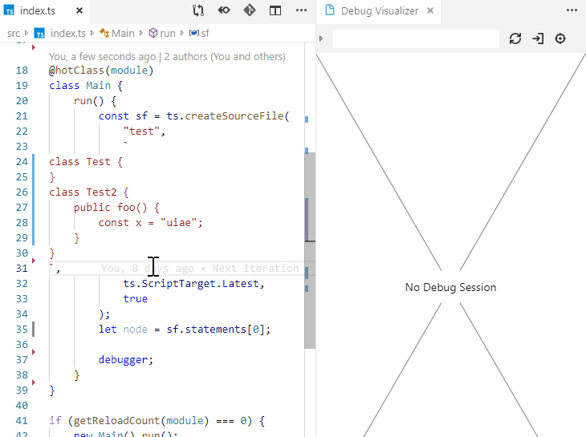

# Debug Visualizer (Preview)

Provides infrastructure to visualize values while debugging.

This extension is still in development.

## Usage

After installing this extension, use the command `Open a new Debug Visualizer View` to open a new visualizer view.
There you can enter an expression that is visualized when debugging your application.

## Integrated Visualizers

Visualizers present preprocessed data.
They are mostly React-Components and live in the webview.

These visualizers are integrated:

-   Tree Viewer
    

-   Svg Viewer
-   Dot Graph Viewer
-   VisJs Graph Viewer
    

-   Graph Viewer
    

-   Text Viewer
    -   Plain Text
    -   Monaco

## Integrated Data Extractors

Data extractors convert arbitrary values into visualizable data.
They live in the debugee.

These visualizers are integrated:

-   ToString Text Extractor
-   TypeScript Ast to Tree Data
    -   Direct Visualization of `ts.Node`s
    -   Visualization of `Record<string, ts.Node>` and `[ts.Node]`. If the record contains a key `fn`, its value is displayed for each node.

-   As Is Data Extractor. Allows to return data directly.

## Limitations

Currently, only JavaScript (and thus TypeScript) values can be visualized and only a few visualizations are supported.

# See Also

This extension works very well together with my library [`@hediet/node-reload`](https://github.com/hediet/node-reload):

